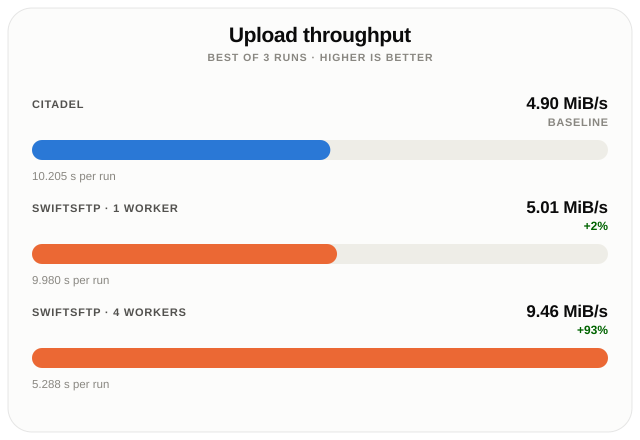
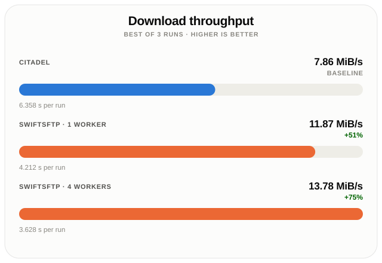

# SwiftSFTP

[](LICENSE)
[](https://swiftpackageindex.com/RuiNelson/SwiftSFTP)

[](https://swiftpackageindex.com/RuiNelson/SwiftSFTP)
[](Package.swift)
[](Package.swift)
[](Package.swift)
[](Package.swift)
[](Package.swift)
[](LinuxBuild/build.sh)
[](AndroidBuild/build.sh)

[](https://swift.org/package-manager/)
[](https://github.com/RuiNelson/SwiftSFTP/releases)
[](https://github.com/RuiNelson/SwiftSFTP/actions/workflows/apple.yml)
[](https://github.com/RuiNelson/SwiftSFTP/actions/workflows/linux.yml)
[](https://github.com/RuiNelson/SwiftSFTP/actions/workflows/android.yml)


SwiftSFTP is a modern, ergonomic Swift Package Manager library that wraps `libssh2` and `OpenSSL`. It provides a high-level `async/await` API for seamless SFTP file transfers and SSH-based interactions, while also exposing the underlying C APIs for advanced use cases.

Whether you need to quickly upload files, manage a remote filesystem, or build anything on top of SSH, SwiftSFTP offers a robust and asynchronous interface built on industry-standard libraries.

**Features:**

- **Ergonomic API**: High-level abstractions over SFTP and SSH functionalities using modern Swift concurrency (`async/await`).
- **Solid Base**: Built on top of the robust and reliable `libssh2` and `OpenSSL` (vendored and statically linked via XCFrameworks for convenience).
- **Fast**: Outperforms other Swift SFTP clients, with multi-worker transfers further increasing throughput; see [Benchmarks](#benchmarks).
- **Resumable Transfers**: `multiUploadResumable` / `multiDownloadResumable` continue an interrupted multi-worker transfer instead of restarting it, keeping their state inside the partial file rather than in a database; see [Resumable parallel transfers](Documentation/UserGuide.md#resumable-parallel-transfers).
- **Cryptographic Utilities**: OpenSSL helpers to validate user keys and `known_hosts` host keys, plus Ed25519 key generation; see [Cryptographic Utilities](Documentation/CryptographicUtils.md).
- **Low-Level Access**: Fully exposed `libssh2` wrappers (Layer 0), allowing users to expand functionality or perform other non-SFTP related SSH tasks.

## Cookbook

Here is a quick-start example showing how to connect, navigate, and upload files using SwiftSFTP:

```swift
import SwiftSFTP
import Foundation

// - Instantiate an SFTP client
let myClient = try SFTPClient(
    openSocketIn: .init(hostname: "localhost", port: 6922),
    hostKeyAcceptance: .acceptAny, // Configurable for strict host key checking
    authentication: .init(name: "bulbasaur", auth: .password("pass123")) // Also supports .privateKey
)

// - Call this to connect
try await myClient.login()

// - Check server banner
let banner = try await myClient.banner
print(banner)

// - Get the home directory
let home = try await myClient.currentWorkingDirectory
print(home)

// - List a directory
let contents = try await myClient.listDirectory(path: "./Fixtures")

// - Open a file handle
if let largestFile = contents.bySize.last {
    let myFileHandle = try await myClient.openFile([.read], path: largestFile.fullPath)

    // Read first bytes
    let firstBytes = try await myFileHandle.read(upTo: 1024)
    
    // Seek
    myFileHandle.offset = 2048
    // ...
    try await myFileHandle.close()
}

// - Upload a file with progress tracking
let localFile = URL(fileURLWithPath: "myfile.zip")
try await myClient.upload(from: localFile, to: "/home/bulbasaur/myfolder/myfile.zip") 
    { doneBytes, totalBytes, lastBlockBytes, lastBlockTime in
        // Return true/false to continue/terminate the upload

        let progress = ((Double(doneBytes) / Double(totalBytes)) * 100).rounded()
        let speed = (Double(lastBlockBytes) / Double(lastBlockTime)).rounded()

        print("Completed \(progress)% at \(speed) B/s")

        return true
    }

// - Delete a file or directory with everything in it (less radical methods available)
try await myClient.delete(path: "myfolder")

// - Close the connection
try await myClient.close()
```

**A complete user guide can be found [here](Documentation/UserGuide.md).**

For offline key validation, host key checks, and Ed25519 key generation, see [Cryptographic Utilities](Documentation/CryptographicUtils.md).

## Adding SwiftSFTP to your Project

### Swift Package Manager

Add the following dependency to your `Package.swift` file:

```swift
dependencies: [
    .package(url: "https://github.com/RuiNelson/SwiftSFTP.git", from: "3.0.0")
]
```

Then, add `SwiftSFTP` to the dependencies of your target:

```swift
targets: [
    .target(
        name: "YourTargetName",
        dependencies: [
            .product(name: "SwiftSFTP", package: "SwiftSFTP"),
        ]
    )
]
```

### Xcode

If you are using Xcode, you can directly add this repository as a Swift Package dependency in your project settings:

1. Navigate to **File > Add Package Dependencies...**
2. Enter the repository URL: `https://github.com/RuiNelson/SwiftSFTP.git`
3. Choose the version rule you prefer (e.g., "Up to Next Major Version") and click **Add Package**.
4. Make sure the `SwiftSFTP` product is added to your app target.

## Benchmarks

Measured with the [`Benchmark`](Benchmark) executable against a real world Wi-Fi connected SFTP server, comparing SwiftSFTP to [Citadel 0.12.1](https://github.com/orlandos-nl/Citadel), another Swift library. Each figure is the best of 3 runs. The test file is 50 MiB in size and contains random data.

<p>
  
  
</p>

With a single connection, SwiftSFTP and Citadel upload at a comparable rate, but SwiftSFTP is already 51% faster at download (11.87 vs. 7.86 MiB/s) before any additional workers are involved.

That single-connection download gap comes down to how each client issues read requests. Citadel's SFTP client sends one read request and awaits its reply before sending the next, so its throughput is limited by how much data the server returns per round trip. libssh2 (the C library SwiftSFTP is built on) reads ahead instead: it keeps several read requests outstanding at once rather than waiting on each one, so more data stays in flight on the same connection. Over a real network, where every round trip has a cost, that difference alone accounts for SwiftSFTP's download lead before `multiDownload` is even used.

SwiftSFTP's advantage grows further when transferring with multiple workers (`multiUpload` / `multiDownload`), which distribute a transfer across several independent TCP connections rather than one.

A single TCP connection's throughput is bounded by its own congestion window: the sender grows it gradually and retreats at the first sign of loss or congestion, which limits how much data one connection can keep in flight at a time, particularly over Wi-Fi, where variable latency and loss trigger that retreat frequently. SFTP's 32 KiB per-packet limit compounds this: libssh2 pipelines writes ahead of the server's acknowledgment, but each outstanding unit is still only 32 KiB, so filling the same congestion window over a higher-latency link takes many more packets than it would with a larger block size. Each `multiUpload` / `multiDownload` worker opens its own TCP connection (with its own congestion window and its own stream of 32 KiB packets), so the transfer as a whole keeps far more data in flight than a single connection allows. This is why four workers nearly double upload throughput above (5.01 → 9.46 MiB/s) and produce a further, smaller gain on download (11.87 → 13.78 MiB/s), which was already closer to what a single connection could sustain on this link.

This throughput is not free:

- **No resume, unless it is asked for.** An interrupted `multiUpload`/`multiDownload` cannot continue from where it left off and must restart from the beginning; neither takes the `resume` parameter that single-worker `upload`/`download` accept. `multiUploadResumable`/`multiDownloadResumable` do resume, at the cost of a partial file that outlives a failed attempt; see below.
- **Additional server load.** Each worker holds its own connection and session open for the duration of the transfer, which some servers rate-limit or cap.
- **Diminishing, link-dependent returns.** The gain from additional workers depends on the link and on the remote server's capacity to service concurrent requests, and will vary across networks; it should not be assumed from the figures above.

Because that last point makes the right worker count a property of the link rather than a constant, `multiTune` measures it: it transfers a test file at increasing parallelism and returns the count that reached the highest throughput. The [`Benchmark`](Benchmark) package ships it as the `swift-sftp-multitune` executable, and the [User's Guide](Documentation/UserGuide.md#choosing-a-worker-count) covers the API.

The first of those points has an answer too. `multiUploadResumable` and `multiDownloadResumable` transfer the same way and add resumption: the bytes go into a temporary file in the destination's own directory, named after the first 128 bits of the SHA-256 of the destination's file name, and which blocks have arrived is recorded in a trailer written past the end of the payload of that same file. There is no database and no sidecar state file — everything a resume needs is inside the file being resumed, and the derived name is how the next call finds its own partial. The trailer is truncated away before the file is renamed onto the destination, so the destination only ever appears complete. A block's bit is set only after its last write has been acknowledged, and the bitmap is written back lazily behind that, so the record of progress always lags the payload and never leads it; an interrupted transfer at worst re-transfers a block it had already moved.

That is paid for elsewhere. An interrupted run leaves its `<hash>.rmt.tmp` file behind deliberately, the source is matched by name, size, and modification time rather than by its content, and nothing prevents two transfers to the same destination from writing into the same temporary file. The [User's Guide](Documentation/UserGuide.md#resumable-parallel-transfers) covers the API, the methods that sweep temporaries abandoned for good, and each of those hazards in full. Where none of this is wanted, single-worker `upload`/`download` resume from a plain byte offset instead.

## License

SwiftSFTP is available under the [Apache License 2.0](LICENSE).

### Third-party licenses

SwiftSFTP depends on the following libraries. Their licenses apply when you use or redistribute SwiftSFTP (including via static linking of vendored binaries such as OpenSSL XCFrameworks).

| Component | Role | License | Source |
| --- | --- | --- | --- |
| **SwiftSFTP** | This package | [Apache License 2.0](LICENSE) | [LICENSE](LICENSE) |
| **libssh2** | SSH/SFTP protocol (vendored C sources) | [BSD-3-Clause](vendor/libssh2/COPYING) | [vendor/libssh2/COPYING](vendor/libssh2/COPYING) |
| **OpenSSL** | Cryptography (vendored; XCFrameworks on Apple platforms, system OpenSSL on Linux/Android) | [Apache License 2.0](vendor/openssl/LICENSE.txt) | [vendor/openssl/LICENSE.txt](vendor/openssl/LICENSE.txt) |
| **PathWorks** | Path utilities (SwiftPM dependency) | [MIT](https://github.com/RuiNelson/PathWorks/blob/main/LICENSE) | [PathWorks](https://github.com/RuiNelson/PathWorks) |
| **swift-log** | Logging (SwiftPM dependency) | [Apache License 2.0](https://github.com/apple/swift-log/blob/main/LICENSE.txt) | [apple/swift-log](https://github.com/apple/swift-log) |

### Use in commercial closed-source software

All of the licenses above are **permissive**. They allow use of SwiftSFTP and its dependencies in proprietary, commercial, closed-source applications (including apps distributed through the App Store and other app stores), **without requiring you to open-source your own code**.

In practice, that means you may:

- Link SwiftSFTP (and the bundled libssh2 / OpenSSL) into closed-source products
- Sell or distribute those products without publishing your application source
- Modify SwiftSFTP or its dependencies for your own use (subject to each license’s terms)

You remain responsible for meeting each license’s **attribution and notice** requirements. Typical obligations when you distribute a binary that includes this software:

- **Apache 2.0** (SwiftSFTP, OpenSSL, swift-log): include a copy of the license; retain copyright and attribution notices; if you modify the licensed work, state that you changed it; if a `NOTICE` file is present, include its attribution notices as required by the license
- **BSD-3-Clause** (libssh2): retain the copyright notice, conditions, and disclaimer in source redistributions; reproduce them in documentation and/or other materials provided with binary redistributions; do not use the copyright holders’ names to endorse your product without permission
- **MIT** (PathWorks): include the copyright notice and permission notice in all copies or substantial portions of the software

A common way to satisfy these is an **About**, **Acknowledgments**, or **Open Source Licenses** screen (or a licenses file shipped with the product) that lists the components above and includes the corresponding license texts.

None of these licenses is copyleft (unlike the GPL family): linking against them does not force your application’s source code to be released under an open-source license.

This section is a practical summary, not legal advice. For compliance questions specific to your product or jurisdiction, consult a lawyer and the full license texts linked above.
