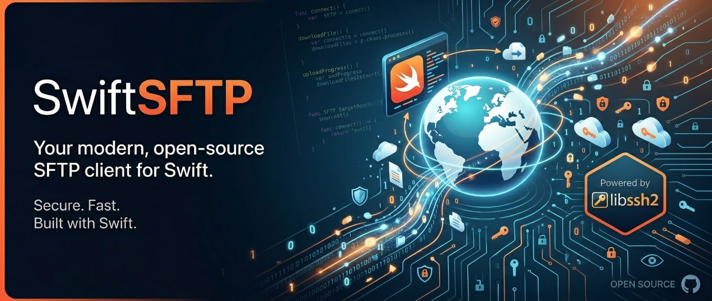

# SwiftSFTP

[](LICENSE)
[](https://swift.org/package-manager/)

[]

SwiftSFTP is a modern, ergonomic Swift Package Manager library that wraps `libssh2` and `OpenSSL`. It provides a high-level `async/await` API for seamless SFTP file transfers and SSH-based interactions, while also exposing the underlying C APIs for advanced use cases. 

Whether you need to quickly upload files, manage a remote filesystem, or validate SSH keys, SwiftSFTP offers a robust and asynchronous interface built on industry-standard libraries.

**Features:**
- **Ergonomic API**: High-level abstractions over SFTP and SSH functionalities using modern Swift concurrency (`async/await`).
- **Solid Base**: Built on top of the robust and reliable `libssh2` and `OpenSSL` (vendored and statically linked via XCFrameworks for convenience).
- **Key Validation**: Exposed OpenSSL helpers to validate private keys effortlessly.
- **Low-Level Access**: Fully exposed `libssh2` wrappers (Layer 0), allowing users to expand functionality or perform other non-SFTP related SSH tasks.

## Cookbook

Here is a quick-start example showing how to connect, navigate, and upload files using SwiftSFTP:

```swift
import SwiftSFTP
import Foundation

// - Instantiate an SFTP client
let myClient = try SFTPClient(
    openSocketIn: .init(hostname: "localhost", port: 6922),
    hostKeyAcceptance: .acceptAny, // Configurable for strict host key checking
    authentication: .init(name: "bulbasaur", auth: .password("pass123")) // Also supports .privateKey
)

// - Call this to connect
try await myClient.login()

// - Check server banner
let banner = try await myClient.banner
print(banner)

// - Get the home directory
let home = try await myClient.currentWorkingDirectory
print(home)

// - List a directory
let contents = try await myClient.listDirectory(path: "./Fixtures")

// - Open a file handle
if let largestFile = contents.bySize.last {
    let myFileHandle = try await myClient.openFile([.read], path: largestFile.fullPath)

    // Read first bytes
    let firstBytes = try await myFileHandle.read(upTo: 1024)
    
    // Seek
    myFileHandle.offset = 2048
    // ...
    try await myFileHandle.close()
}

// - Upload a file with progress tracking
let localFile = URL(fileURLWithPath: "myfile.zip")
try await myClient.upload(from: localFile, to: "/home/bulbasaur/myfolder/myfile.zip") 
    { doneBytes, totalBytes, lastBlockBytes, lastBlockTime in
        // Return true/false to continue/terminate the upload

        let progress = ((Double(doneBytes) / Double(totalBytes)) * 100).rounded()
        let speed = (Double(lastBlockBytes) / Double(lastBlockTime)).rounded()

        print("Completed \(progress)% at \(speed) B/s")

        return true
    }

// - Delete a file or directory with everything in it (less radical methods available)
try await myClient.delete(path: "myfolder")

// - Close the connection
try await myClient.close()
```

A complete user guide can be found [here](Documentation/UserGuide.md).

## Adding SwiftSFTP to your Project

### Swift Package Manager

Add the following dependency to your `Package.swift` file:

```swift
dependencies: [
    .package(url: "https://github.com/RuiNelson/SwiftSFTP.git", from: "1.0.0")
]
```

Then, add `SwiftSFTP` to the dependencies of your target:

```swift
targets: [
    .target(
        name: "YourTargetName",
        dependencies: [
            .product(name: "SwiftSFTP", package: "SwiftSFTP"),
        ]
    )
]
```

### Xcode

If you are using Xcode, you can directly add this repository as a Swift Package dependency in your project settings:

1. Navigate to **File > Add Package Dependencies...**
2. Enter the repository URL: `https://github.com/RuiNelson/SwiftSFTP.git`
3. Choose the version rule you prefer (e.g., "Up to Next Major Version") and click **Add Package**.
4. Make sure the `SwiftSFTP` product is added to your app target.

## License

SwiftSFTP is available under the MIT license. See the [LICENSE](LICENSE) file for more info.
